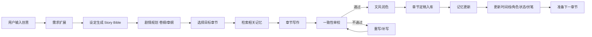

```mermaid
flowchart LR
    A["用户输入创意"] --> B["需求扩展"]
    B --> C["设定生成 Story Bible"]
    C --> D["剧情规划 卷纲/章纲"]
    D --> E["选择目标章节"]

    E --> F["检索相关记忆"]
    F --> G["章节写作"]
    G --> H["一致性审校"]

    H -->|通过| I["文风润色"]
    H -->|不通过| J["重写/补写"]
    J --> H

    I --> K["章节定稿入库"]
    K --> L["记忆更新"]
    L --> M["更新时间线/角色状态/伏笔"]
    M --> N["准备下一章节"]

```
